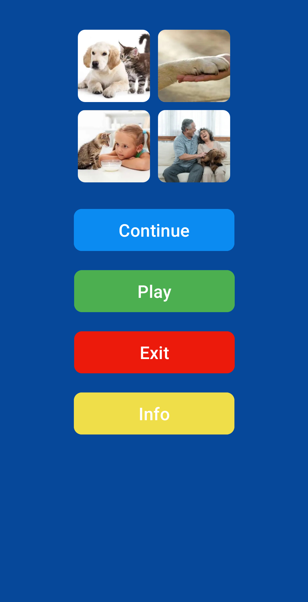

# 4Pic1Word

4Pic1Word is an engaging Android puzzle game where players must find the common word linking four given images. It challenges vocabulary and logical thinking skills.

## 🧩 Features

- **Guess the Word from 4 Pictures** 🖼️
- **Simple and Interactive Gameplay** 🎮
- **Progress Saving with Shared Preferences** 💾
- **User-Friendly Interface with XML Layouts** 🎨

## 🛠 Technologies Used

- **Activity-based Architecture** 📱
- **XML for UI Design** 🎨
- **Shared Preferences** for Data Storage 💾
- **MVP Architecture** for Clean Code Structure 🔧

## 📸 Screenshots

Below are some screenshots of the application:

<table>
  <tr>
    <td></td>
    <td></td>
    <td></td>
  </tr>
</table>

## 🚀 Try the App

Download the APK and try it out.

---

**Author: Imotdinov Bunyodbek**  
**Contact: [imotdinovbunyodbek2@gmail.com](mailto:imotdinovbunyodbek2@gmail.com)
